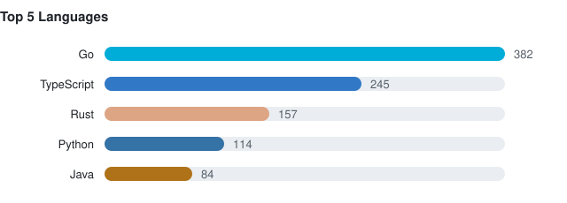

# compscie

LeetCode solutions and computer-science research notes.

## LeetCode

**596 problems solved**, filed by difficulty - one folder each, with one file per language I solved it in. Full index: [leetcode/README.md](leetcode/README.md).

| | Count |
| --- | ---: |
| [Easy](leetcode/README.md#easy) | 259 |
| [Medium](leetcode/README.md#medium) | 304 |
| [Hard](leetcode/README.md#hard) | 24 |
| [Misc](leetcode/README.md#misc) | 9 |
| **Total** | **596** |

### Languages

## Notes

Research notes and deep dives, exported from my Notion knowledge base.

- [go](notes/go/) - 20 page(s)
