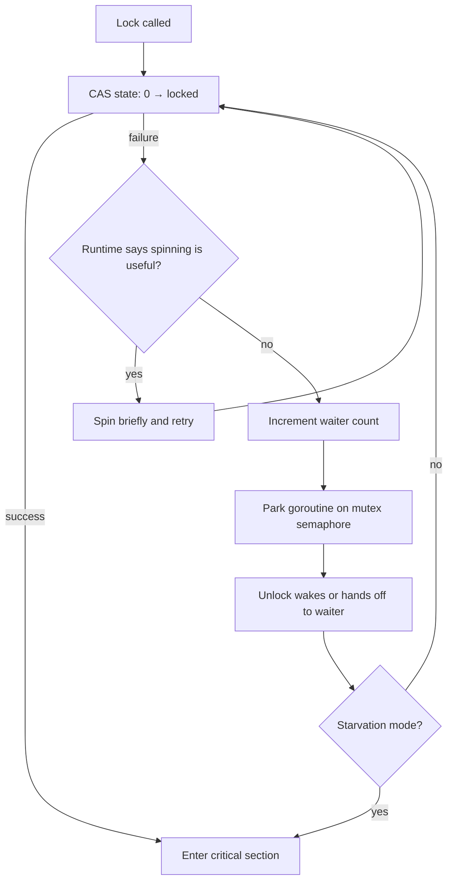

# Go sync.Mutex — Internals

> Exported from Notion on 2026-08-23 · [Source](https://app.notion.com/p/3b2a407e452d814586d9fc7f1bf8e877)

> 🧠 Go's `sync.Mutex` is a compact adaptive lock: it begins with an atomic fast path, spins briefly when useful, and parks the goroutine only under sustained contention.

## 1. Internal Representation

Current Go exposes a public wrapper around `internal/sync.Mutex`:

```go
type Mutex struct {
	_  noCopy
	mu internal_sync.Mutex
}

type internalMutex struct {
	state int32
	sema  uint32
}
```

`noCopy` helps `go vet` detect accidental copying. The effective synchronization state is held in two 32-bit words.

### State Word

```plain text
31                                     3  2          1       0
┌───────────────────────────────────────┬───────────┬───────┬───────┐
│            waiter count               │ starving  │ woken │ locked│
└───────────────────────────────────────┴───────────┴───────┴───────┘
```

- `locked`: the mutex is held.
- `woken`: one waiter has already been awakened, preventing redundant wakeups.
- `starving`: ownership should be handed directly to queued waiters.
- Upper bits: number of waiting goroutines.
- `sema`: runtime semaphore used to park and awaken goroutines.

## 2. Lock Fast Path

The uncontended path is a single atomic compare-and-swap:

```go
func (m *Mutex) Lock() {
	if atomic.CompareAndSwapInt32(&m.state, 0, mutexLocked) {
		return
	}
	m.lockSlow()
}
```

```plain text
state = 0
   │
   │ CAS 0 → locked
   ▼
lock acquired
```

No queue, scheduler operation, or system call is needed.

## 3. Contended Lock Path



### Active Spinning

Before sleeping, the goroutine may spin briefly when the runtime predicts that the owner will release the lock soon and parallel execution is available. Spinning avoids parking and rescheduling costs for short critical sections. It is disabled in starvation mode.

### Parking

If spinning fails, the goroutine:

1. Atomically increments the waiter count.
2. Calls the runtime semaphore acquire operation.
3. Is represented by a runtime `sudog`.
4. Is placed in a wait queue.
5. Is parked with `gopark`.

Parking suspends the goroutine, not necessarily its operating-system thread. The scheduler can use that thread to run another goroutine.

## 4. Normal and Starvation Modes

### Normal Mode

Waiters are queued approximately FIFO, but a woken waiter does not immediately own the mutex. It competes with newly arriving goroutines:

```plain text
Unlock wakes waiter
        │
        ▼
Old waiter ─────┐
                ├──► race to acquire mutex
New goroutine ──┘
```

New arrivals are already running and may acquire the lock first. This barging behavior improves throughput.

### Starvation Mode

If a waiter fails to acquire the mutex for approximately one millisecond, it can switch the mutex into starvation mode:

```plain text
Normal mode:     unlock → wake waiter → waiter competes
Starvation mode: unlock ──────────────► direct ownership handoff
```

In starvation mode:

- Ownership is handed directly to the waiter at the front.
- New arrivals do not spin or steal the mutex.
- New arrivals join the back of the queue.
- The unlocking goroutine may yield its processor time slice to the waiter.

The mutex returns to normal mode when the receiving waiter is the final waiter or waited for less than one millisecond.

> ⚡ **Normal mode** prioritizes throughput.

> ⚖️ **Starvation mode** protects fairness and tail latency.

## 5. Unlock Path

```go
func (m *Mutex) Unlock() {
	new := atomic.AddInt32(&m.state, -mutexLocked)
	if new != 0 {
		m.unlockSlow(new)
	}
}
```

If the resulting state is zero, no waiter exists and unlocking is finished. Otherwise:

- Normal mode wakes one waiter, which competes for ownership.
- Starvation mode directly hands ownership to the next waiter.
- Unlocking an already-unlocked mutex produces a fatal runtime error.

## 6. Runtime Semaphore Queues

The `sema` field does not directly contain a queue. Its address identifies a queue maintained by the runtime:

```plain text
Mutex.sema address
        │ hash
        ▼
runtime semaphore table
        │
        ▼
tree entry for this address
        │
        ▼
sudog → sudog → sudog
  G1       G2       G3
```

The runtime semaphore is best understood as a reliable sleep/wakeup mechanism. It prevents a wakeup from being lost when `Unlock` races with a goroutine preparing to sleep.

## 7. Complete Mental Model

```plain text
Lock:
    atomic CAS
       ↓ failure
    short adaptive spin
       ↓ failure
    register as waiter
       ↓
    park goroutine
       ↓
    wake and compete, or receive direct handoff

Unlock:
    atomically clear locked bit
       ↓
    no waiters → return
    normal mode → wake one
    starvation mode → direct handoff
```

Go's mutex is therefore neither a pure spinlock nor a simple sleeping lock. It dynamically combines atomic acquisition, active spinning, scheduler parking, competitive wake-up, and fair handoff.

## 8. Memory-Model Guarantees

For calls `n < m`, the n-th `Unlock` **synchronizes before** the m-th successful `Lock`. A successful `TryLock` is equivalent to `Lock` for synchronization; a failed `TryLock` establishes no happens-before edge at all.

A mutex is not associated with a goroutine, so one goroutine may lock it and another may unlock it. That is occasionally useful for handoff protocols, but ordinary code should keep ownership obvious. A `Mutex` must not be copied after first use; use pointer receivers for structs that contain one.

## 9. Profiling Contention

- The mutex profile attributes time spent waiting for contended mutexes; configure sampling with `runtime.SetMutexProfileFraction` and inspect `/debug/pprof/mutex`.
- The block profile covers a broader set of blocking operations; configure it with `runtime.SetBlockProfileRate`.
- A profile identifies contention sites, not automatically oversized critical sections—pair it with code inspection and execution traces.

## Official Sources

- [Public `sync.Mutex` source](https://go.dev/src/sync/mutex.go)
- [Internal mutex implementation](https://go.dev/src/internal/sync/mutex.go)
- [Runtime semaphore implementation](https://go.dev/src/runtime/sema.go)
- [Package documentation](https://pkg.go.dev/sync#Mutex)
